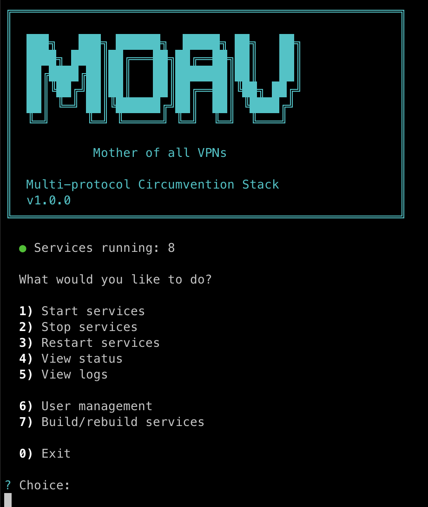

# MoaV

[](https://moav.sh)  [](CHANGELOG.md)  [](LICENSE) 

English | **[فارسی](README-fa.md)** 

Multi-protocol censorship circumvention stack optimized for hostile network environments.

## Features

- **Multiple protocols** - Reality (VLESS), Trojan, Hysteria2, TrustTunnel, AmneziaWG, WireGuard (direct & wstunnel), DNS tunnels (dnstt + Slipstream), Telegram MTProxy, CDN (VLESS+WS)
- **Stealth-first** - All traffic looks like normal HTTPS, WebSocket, DNS, or IMAPS
- **Per-user credentials** - Create, revoke, and manage users independently
- **Easy deployment** - Docker Compose based, single command setup
- **Mobile-friendly** - QR codes and links for easy client import
- **Decoy website** - Serves innocent content to unauthenticated visitors
- **Home server ready** - Run on Raspberry Pi or any ARM64/x64 Linux as a personal VPN
- **[Psiphon Conduit](https://github.com/Psiphon-Inc/conduit)** - Optional bandwidth donation to help others bypass censorship
- **[Tor Snowflake](https://snowflake.torproject.org/)** - Optional bandwidth donation to help Tor users bypass censorship
- **Monitoring** - Optional Grafana + Prometheus observability stack

## Quick Start

**One-liner install** (recommended):

```bash
curl -fsSL moav.sh/install.sh | bash
```

This will:
- Install prerequisites (Docker, git, qrencode) if missing
- Clone MoaV to `/opt/moav`
- Prompt for domain, email, and admin password
- Offer to install `moav` command globally
- Launch the interactive setup

**Manual install** (alternative):

```bash
git clone https://github.com/shayanb/MoaV.git
cd MoaV
cp .env.example .env
nano .env  # Set DOMAIN, ACME_EMAIL, ADMIN_PASSWORD
./moav.sh
```

<!-- TODO: Screenshot of moav.sh interactive menu terminal -->


**After installation, use `moav` from anywhere:**

```bash
moav                      # Interactive menu
moav help                 # Show all commands
moav start                # Start all services
moav stop                 # Stop all services
moav logs                 # View logs
moav update               # Update MoaV (git pull)
moav user add joe         # Add user
```

**Manual docker commands** (alternative):

```bash
docker compose --profile all build                 # Build all images
docker compose --profile setup run --rm bootstrap  # Initialize
docker compose --profile all up -d                 # Start all services
```

See [docs/SETUP.md](docs/SETUP.md) for complete setup instructions.

### Deploy Your Own

[](docs/DEPLOY.md#hetzner)  [](docs/DEPLOY.md#linode)  [](docs/DEPLOY.md#vultr)  [](docs/DEPLOY.md#digitalocean)


## Architecture

```
                                                              ┌───────────────┐  ┌───────────────┐
       ┌───────────────┐                                      │ Psiphon Users │  │   Tor Users   │
       │  Your Clients │                                      │  (worldwide)  │  │  (worldwide)  │
       │   (private)   │                                      └───────┬───────┘  └───────┬───────┘
       └───────┬───────┘                                              │                  │
               │                                                      │                  │
               ├─────────────────┐                                    │                  │
               │                 │ (when IP blocked)                  │                  │
               │          ┌──────┴───────┐                            │                  │
               │          │ Cloudflare   │                            │                  │
               │          │  CDN (VLESS) │                            │                  │
               │          └──────┬───────┘                            │                  │
               │                 │                                    │                  │
┌──────────────╪─────────────────╪────────────────────────────────────╪──────────────────╪─────────┐
│              │                 │          Restricted Internet       │                  │         │
└──────────────╪─────────────────╪────────────────────────────────────╪──────────────────╪─────────┘
               │                 │                                    │                  │
╔══════════════╪═════════════════╪════════════════════════════════════╪══════════════════╪═════════╗
║              │                 │                                    │                  │         ║
║     ┌────────┼─────────────────┼───────┼──────┐                     │                  │         ║
║     │        │         │       │       │      │                     │                  │         ║
║     ▼        ▼         ▼       ▼       ▼      ▼                     ▼                  ▼         ║
║ ┌─────────┐┌─────────┐┌───────┐┌─────────┐┌────────┐          ┌───────────┐      ┌───────────┐   ║
║ │ Reality ││WireGuard││ Trust ││  DNS    ││Telegram│          │           │      │           │   ║
║ │ 443/tcp ││51820/udp││Tunnel ││ 53/udp  ││MTProxy │          │  Conduit  │      │ Snowflake │   ║
║ │ Trojan  ││AmneziaWG││4443/  │├─────────┤│993/tcp │          │  (donate  │      │  (donate  │   ║
║ │8443/tcp ││51821/udp││tcp+udp││  dnstt  │└───┬────┘          │ bandwidth)│      │ bandwidth)│   ║
║ │Hysteria2││wstunnel ││       ││Slipstrm │    │               └─────┬─────┘      └─────┬─────┘   ║
║ │ 443/udp ││8080/tcp ││       │└────┬────┘    │                     │                  │         ║
║ │ CDN WS  │└────┬────┘└───┬───┘     │         │                     │                  │         ║
║ │2082/tcp │     │         │         │         │  ┌────────────────┐ │                  │     M   ║
║ ├─────────┤     │         │         │         │  │ Grafana  :9444 │ │                  │     O   ║
║ │ sing-box│     │         │         │         │  │ Prometheus     │ │                  │     A   ║
║ └────┬────┘     │         │         │         │  └────────────────┘ │                  │     V   ║
║      │          │         │         │         │                     │                  │         ║
╚══════╪══════════╪═════════╪═════════╪═════════╪═════════════════════╪══════════════════╪═════════╝
       │          │         │         │         │                     │                  │
       ▼          ▼         ▼         ▼         ▼                     ▼                  ▼
┌─────────────────────────────────────────────────────────────────────────────────────────────────┐
│                                        Open Internet                                            │
└─────────────────────────────────────────────────────────────────────────────────────────────────┘
```

## Protocols

| Protocol | Port | Stealth | Speed | Use Case |
|----------|------|---------|-------|----------|
| Reality (VLESS) | 443/tcp | ★★★★★ | ★★★★☆ | Primary, most reliable |
| Hysteria2 | 443/udp | ★★★★☆ | ★★★★★ | Fast, works when TCP throttled |
| Trojan | 8443/tcp | ★★★★☆ | ★★★★☆ | Backup, uses your domain |
| CDN (VLESS+WS) | 443 via Cloudflare | ★★★★★ | ★★★☆☆ | When server IP is blocked |
| TrustTunnel | 4443/tcp+udp | ★★★★★ | ★★★★☆ | HTTP/2 & QUIC, looks like HTTPS |
| WireGuard (Direct) | 51820/udp | ★★★☆☆ | ★★★★★ | Full VPN, simple setup |
| AmneziaWG | 51821/udp | ★★★★★ | ★★★★☆ | Obfuscated WireGuard, defeats DPI |
| WireGuard (wstunnel) | 8080/tcp | ★★★★☆ | ★★★★☆ | VPN when UDP is blocked |
| DNS Tunnel (dnstt) | 53/udp | ★★★☆☆ | ★☆☆☆☆ | Last resort, hard to block |
| Slipstream | 53/udp | ★★★☆☆ | ★★☆☆☆ | QUIC-over-DNS, 1.5-5x faster than dnstt |
| Telegram MTProxy | 993/tcp | ★★★★☆ | ★★★☆☆ | Fake-TLS V2, direct Telegram access |
| Psiphon | - | ★★★★☆ | ★★★☆☆ | Standalone, no server needed |
| Tor (Snowflake) | - | ★★★★☆ | ★★☆☆☆ | Standalone, uses Tor network |

## User Management

```bash
# Using moav (recommended)
moav user list            # List all users (or: moav users)
moav user add joe         # Add user to all services
moav user add alice bob   # Add multiple users
moav user add --batch 5   # Batch create user01..user05
moav user revoke joe      # Revoke user from all services
```

**Manual scripts** (for advanced use):

```bash
# Add to specific services only
./scripts/singbox-user-add.sh joe     # Reality, Trojan, Hysteria2
./scripts/wg-user-add.sh joe          # WireGuard only

# Revoke from specific services only
./scripts/singbox-user-revoke.sh joe
./scripts/wg-user-revoke.sh joe
```

User bundles are generated in `outputs/bundles/<username>/` containing:
- Config files for each protocol
- QR codes for mobile import
- README with connection instructions

**Download bundles:**
<!-- TODO: Screenshot of admin dashboard showing user bundles section -->
- **Admin dashboard** - Visit `https://your-server:9443`, login, and download from "User Bundles" section
- **SCP** - `scp root@SERVER:/opt/moav/outputs/bundles/username.zip ./`

## Service Management

```bash
moav status               # Show all service status
moav start                # Start all services
moav start proxy admin    # Start specific profiles
moav stop                 # Stop all services
moav stop conduit         # Stop specific service
moav restart sing-box     # Restart specific service
moav logs                 # View all logs (follow mode)
moav logs conduit         # View specific service logs
moav build                # Build/rebuild all containers
```

**Profiles:** `proxy`, `wireguard`, `amneziawg`, `dnstunnel`, `trusttunnel`, `telegram`, `admin`, `conduit`, `snowflake`, `monitoring`, `all`

## Server Migration

Export and migrate your MoaV installation to a new server:

```bash
# Export full backup (keys, users, configs)
moav export                        # Creates moav-backup-TIMESTAMP.tar.gz

# On new server: import and update IP
moav import moav-backup-*.tar.gz   # Restore configuration
moav migrate-ip 1.2.3.4            # Update all configs to new IP
moav start                         # Start services
```

See [docs/SETUP.md](docs/SETUP.md#server-migration) for detailed migration workflow.

## Testing & Client

MoaV includes a built-in client container for testing connectivity and connecting through your server.

### Test Mode

Verify that all protocols are working for a user:

```bash
moav test user1           # Test all protocols for user1
moav test user1 --json    # Output results as JSON
```

Tests Reality, Trojan, Hysteria2, TrustTunnel, WireGuard, AmneziaWG, dnstt, Slipstream, and Telegram MTProxy. Reports pass/fail/skip for each protocol.

### Client Mode

Use MoaV as a client to connect through your server (runs SOCKS5/HTTP proxy locally):

```bash
moav client connect user1              # Auto-detect best protocol
moav client connect user1 --protocol reality   # Force specific protocol
moav client connect user1 --protocol hysteria2
```

The client exposes:
- SOCKS5 proxy on port 1080 (configurable via `CLIENT_SOCKS_PORT`)
- HTTP proxy on port 8080 (configurable via `CLIENT_HTTP_PORT`)

Available protocols: `reality`, `trojan`, `hysteria2`, `trusttunnel`, `wireguard`, `dnstt`, `slipstream`, `psiphon`, `tor`

Build the client image separately:
```bash
moav client build
```

**Service aliases:** `conduit`→psiphon-conduit, `singbox`→sing-box, `wg`→wireguard, `dns/dnstt/slip`→dnstunnel, `tg/mtproxy`→telemt

## Conduit Management

If running Psiphon Conduit to donate bandwidth:

```bash
moav logs conduit             # View conduit logs (Ryve link shown on startup)
./scripts/conduit-info.sh     # Get Ryve deep link for mobile import
```

## Client Apps

| Platform | Recommended Apps |
|----------|------------------|
| iOS | Streisand, Hiddify, WireGuard, TrustTunnel, Psiphon, Shadowrocket |
| Android | v2rayNG, Hiddify, WireGuard, TrustTunnel, Psiphon, NekoBox |
| macOS | Hiddify, Streisand, WireGuard, TrustTunnel, Psiphon |
| Windows | v2rayN, Hiddify, WireGuard, TrustTunnel, Psiphon |
| Linux | Hiddify, sing-box, WireGuard, TrustTunnel |

See [docs/CLIENTS.md](docs/CLIENTS.md) for complete list and setup instructions.

## Documentation

- [Setup Guide](docs/SETUP.md) - Complete installation instructions
- [CLI Reference](docs/CLI.md) - All moav commands and options
- [DNS Configuration](docs/DNS.md) - DNS records setup
- [Client Setup](docs/CLIENTS.md) - How to connect from devices
- [VPS Deployment](docs/DEPLOY.md) - One-click cloud deployment
- [Monitoring](docs/MONITORING.md) - Grafana + Prometheus observability
- [Troubleshooting](docs/TROUBLESHOOTING.md) - Common issues and solutions
- [OpSec Guide](docs/OPSEC.md) - Security best practices

## Requirements

**Server:**
- Debian 12, Ubuntu 22.04/24.04
- 1 vCPU, 1 GB RAM minimum (2 vCPU, 2 GB RAM if using monitoring)
- Public IPv4
- Domain name (optional - see Domain-less Mode below)

**Ports (open as needed):**
| Port | Protocol | Service | Requires Domain |
|------|----------|---------|-----------------|
| 443/tcp | TCP | Reality (VLESS) | Yes |
| 443/udp | UDP | Hysteria2 | Yes |
| 8443/tcp | TCP | Trojan | Yes |
| 4443/tcp+udp | TCP+UDP | TrustTunnel | Yes |
| 2082/tcp | TCP | CDN WebSocket | Yes (Cloudflare) |
| 51820/udp | UDP | WireGuard | No |
| 51821/udp | UDP | AmneziaWG | No |
| 8080/tcp | TCP | wstunnel | No |
| 993/tcp | TCP | Telegram MTProxy | No |
| 9443/tcp | TCP | Admin dashboard | No |
| 9444/tcp | TCP | Grafana (monitoring) | No |
| 53/udp | UDP | DNS tunnel | Yes |
| 80/tcp | TCP | Let's Encrypt | Yes (during setup) |

### Domain-less Mode

Don't have a domain? MoaV can run in **domain-less mode** with:
- **WireGuard** (direct UDP + WebSocket tunnel)
- **AmneziaWG** (obfuscated WireGuard, defeats DPI)
- **Telegram MTProxy** (fake-TLS, direct Telegram access)
- **Admin dashboard** (uses self-signed certificate)
- **Conduit** (Psiphon bandwidth donation)
- **Snowflake** (Tor bandwidth donation)

Run `moav` and select "No domain" when prompted, or use `moav domainless` to configure.

**Recommended VPS:**
- VPS Price Trackers: [VPS-PRICES](https://vps-prices.com/)، [VPS Price Tracker](https://vpspricetracker.com/), [Cheap VPS Price Cheat Sheet](https://docs.google.com/spreadsheets/d/e/2PACX-1vTOC_THbM2RZzfRUhFCNp3SDXKdYDkfmccis4vxr7WtVIcPmXM-2lGKuZTBr8o_MIJ4XgIUYz1BmcqM/pubhtml)
- [Time4VPS](https://www.time4vps.com/?affid=8471): 1 vCPU، 1GB RAM، IPv4، 3.99€/Month


## Project Structure

```
MoaV/
├── moav.sh                 # CLI management tool (install with: ./moav.sh install)
├── docker-compose.yml      # Main compose file
├── .env.example            # Environment template
├── Dockerfile.*            # Container definitions
├── configs/                # Service configurations
│   ├── sing-box/
│   ├── wireguard/
│   ├── amneziawg/
│   ├── trusttunnel/
│   ├── dnstt/
│   ├── telemt/
│   └── monitoring/
├── scripts/                # Management scripts
│   ├── bootstrap.sh
│   ├── user-add.sh
│   ├── user-revoke.sh
│   └── lib/
├── outputs/                # Generated configs (gitignored)
│   └── bundles/
├── web/                    # Decoy website
├── admin/                  # Stats dashboard
└── docs/                   # Documentation
```

## Security

- All protocols require authentication
- Decoy website for unauthenticated traffic
- Per-user credentials with instant revocation
- Minimal logging (no URLs, no content)
- TLS 1.3 everywhere

See [docs/OPSEC.md](docs/OPSEC.md) for security guidelines.

## License

MIT

## Changelog
See [CHANGELOG.md](CHANGELOG.md) for release notes and version history.


## Disclaimer

This project provides **general-purpose open-source networking software** only.

It is not a service, not a platform, and not an operated network.

The authors and contributors:
- Do not operate infrastructure
- Do not provide access
- Do not distribute credentials
- Do not manage users
- Do not coordinate deployments

All usage, deployment, and operation are the sole responsibility of third parties.

This software is provided **“AS IS”**, without warranty of any kind.  
The authors and contributors accept **no liability** for any use or misuse of this software.

Users are responsible for complying with all applicable laws and regulations.