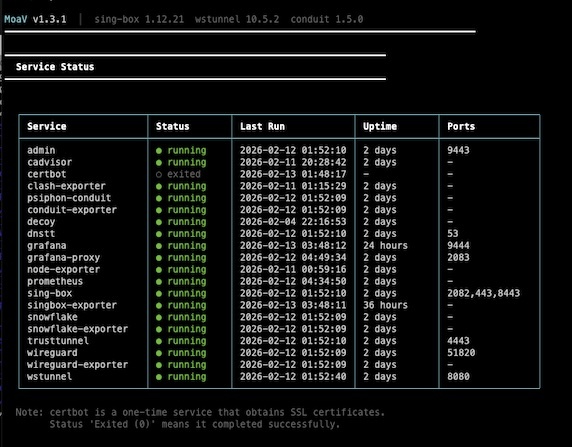
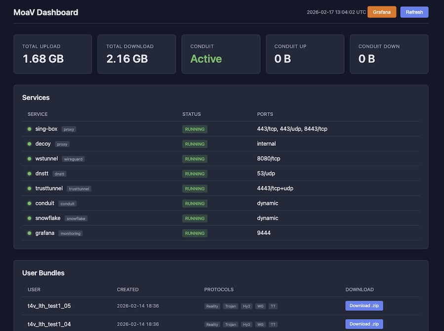

# MoaV Setup Guide

Complete guide to deploy MoaV on a VPS or home server.

## Table of Contents

- [Prerequisites](#prerequisites)
- [Quick Start](#quick-start)
- [Step-by-Step Setup](#step-by-step-setup)
  - [Step 1: Get a Server](#step-1-get-a-server)
  - [Step 2: Configure DNS](#step-2-configure-dns)
  - [Step 3: Install MoaV](#step-3-install-moav)
  - [Step 4: Configure Environment](#step-4-configure-environment)
  - [Step 5: Run Bootstrap](#step-5-run-bootstrap)
  - [Step 6: Start Services](#step-6-start-services)
  - [Step 7: Download User Bundles](#step-7-download-user-bundles)
  - [Step 8: Distribute to Users](#step-8-distribute-to-users)
- [Domain-less Mode](#domain-less-mode)
- [CDN-Fronted Mode (Cloudflare)](#cdn-fronted-mode-cloudflare)
- [Managing Users](#managing-users)
- [Service Management](#service-management)
- [Server Migration](#server-migration)
- [IPv6 Support](#ipv6-support)
- [Bandwidth Donation (Conduit & Snowflake)](#bandwidth-donation-conduit--snowflake)
- [Updating MoaV](#updating-moav)
- [Re-bootstrapping](#re-bootstrapping)

---

## Prerequisites

**Server Requirements:**
- Debian 12, Ubuntu 22.04, or Ubuntu 24.04 (Raspberry Pi OS works too)
- Architecture: x64 (AMD64) or ARM64 (Raspberry Pi 4, Apple Silicon)
- Minimum: 1 vCPU, 1GB RAM, 10GB disk
- Public IPv4 address
- Public IPv6 address (optional, see [IPv6 Support](#ipv6-support))

**Domain (Optional but Recommended):**
- Required for: Reality, Trojan, Hysteria2, TrustTunnel, CDN mode, DNS tunnels (dnstt, Slipstream)
- Not required for: Reality, WireGuard, AmneziaWG, Telegram MTProxy, Admin dashboard, Conduit, Snowflake
- See [Domain-less Mode](#domain-less-mode) if you don't have a domain

**Ports to Open:**

| Port | Protocol | Service | Requires Domain |
|------|----------|---------|-----------------|
| 443/tcp | TCP | Reality (VLESS) | Yes |
| 443/udp | UDP | Hysteria2 | Yes |
| 8443/tcp | TCP | Trojan | Yes |
| 4443/tcp+udp | TCP+UDP | TrustTunnel | Yes |
| 2082/tcp | TCP | CDN WebSocket | Yes (Cloudflare) |
| 51820/udp | UDP | WireGuard | No |
| 51821/udp | UDP | AmneziaWG | No |
| 8080/tcp | TCP | wstunnel | No |
| 9443/tcp | TCP | Admin dashboard | No |
| 9444/tcp | TCP | Grafana (monitoring) | No |
| 993/tcp | TCP | Telegram MTProxy (telemt) | No |
| 53/udp | UDP | DNS tunnels (dnstt + Slipstream) | Yes |
| 80/tcp | TCP | Let's Encrypt | Yes (during setup) |

---

## Quick Start

For experienced users who want the fastest path:

```bash
# 1. SSH into your VPS
ssh root@YOUR_SERVER_IP

# 2. Run the installer
curl -fsSL moav.sh/install.sh | bash

# 3. Follow the interactive prompts
# 4. Done! User bundles are in /opt/moav/outputs/bundles/
```

The installer handles everything: Docker, dependencies, configuration, and first-time setup.

---

## Step-by-Step Setup

### Step 1: Get a Server

Choose a VPS provider and create a server:

| Provider | Minimum Plan | Price | Deploy Guide |
|----------|--------------|-------|--------------|
| Hetzner | CX22 (2 vCPU, 4GB) | €5.39/mo | [DEPLOY.md#hetzner](DEPLOY.md#hetzner) |
| DigitalOcean | Basic (1 vCPU, 1GB) | $6/mo | [DEPLOY.md#digitalocean](DEPLOY.md#digitalocean) |
| Vultr | 25GB SSD (1 vCPU, 1GB) | $5/mo | [DEPLOY.md#vultr](DEPLOY.md#vultr) |
| Linode | Nanode 1GB | $5/mo | [DEPLOY.md#linode](DEPLOY.md#linode) |

- VPS Price Trackers: [VPS-PRICES](https://vps-prices.com/)، [VPS Price Tracker](https://vpspricetracker.com/), [Cheap VPS Price Cheat Sheet](https://docs.google.com/spreadsheets/d/e/2PACX-1vTOC_THbM2RZzfRUhFCNp3SDXKdYDkfmccis4vxr7WtVIcPmXM-2lGKuZTBr8o_MIJ4XgIUYz1BmcqM/pubhtml)
- [Time4VPS](https://www.time4vps.com/?affid=8471): 1 vCPU، 1GB RAM، IPv4، 3.99€/ماه 


**Home Server:** Raspberry Pi 4 (2GB+ RAM) or any ARM64/x64 Linux works. See [DNS.md](DNS.md#dynamic-dns-for-home-servers) for dynamic DNS setup.


### Step 2: Configure DNS

Point your domain to your server **before** running setup.

**Minimum DNS Records:**

| Type | Name | Value | Notes |
|------|------|-------|-------|
| A | @ | YOUR_SERVER_IP | Main domain |

**Additional Records (for all features):**

| Type | Name | Value | Notes |
|------|------|-------|-------|
| A | dns | YOUR_SERVER_IP | For DNS tunnel NS delegation |
| NS | t | dns.yourdomain.com | DNS tunnel subdomain |
| A | cdn | YOUR_SERVER_IP | CDN mode (Cloudflare: **Proxied** orange cloud) |

**Important:** For Cloudflare users, the main `@` record must be **DNS only** (gray cloud). Only the `cdn` record should be **Proxied** (orange cloud).

See [DNS.md](DNS.md) for provider-specific instructions.

**Verify DNS is working:**
```bash
dig +short yourdomain.com
# Should return your server IP
```

### Step 3: Install MoaV

SSH into your server and run:

```bash
curl -fsSL moav.sh/install.sh | bash
```

This installs:
- Docker and Docker Compose
- Git and qrencode
- MoaV to `/opt/moav`
- `moav` command (available globally)

**Manual Installation** (if you prefer):
```bash
# Install Docker
curl -fsSL https://get.docker.com | sh

# Install dependencies
apt install -y git qrencode

# Clone MoaV
git clone https://github.com/shayanb/MoaV.git /opt/moav
cd /opt/moav
```

### Step 4: Configure Environment

```bash
cd /opt/moav
cp .env.example .env
nano .env
```

**Required Settings:**

```bash
# Your domain (must match DNS from Step 2)
DOMAIN=yourdomain.com

# Email for Let's Encrypt certificates
ACME_EMAIL=you@example.com

# Admin dashboard password (change this!)
ADMIN_PASSWORD=your-secure-password
```

**Optional Settings:**

```bash
# Server IP (auto-detected if empty)
SERVER_IP=

# Initial users to create (default: 5)
INITIAL_USERS=5

# Reality target (site to impersonate)
# Good choices: dl.google.com, www.apple.com, www.doi.org
REALITY_TARGET=dl.google.com:443

# CDN domain (optional, Cloudflare-proxied subdomain)
CDN_DOMAIN=cdn.yourdomain.com

# Enable/disable services
ENABLE_REALITY=true
ENABLE_TROJAN=true
ENABLE_HYSTERIA2=true
ENABLE_WIREGUARD=true
ENABLE_DNSTT=true
ENABLE_TRUSTTUNNEL=true
ENABLE_PSIPHON_CONDUIT=false
ENABLE_ADMIN_UI=true
```

### Step 5: Run Bootstrap

Initialize MoaV (generates keys, obtains certificates, creates users):

```bash
moav bootstrap
# Or manually:
docker compose --profile setup run --rm bootstrap
```

This will:
1. Generate Reality and dnstt keypairs
2. Obtain TLS certificate from Let's Encrypt
3. Generate WireGuard server keys
4. Create initial users (default: 5)
5. Generate user bundles with configs and QR codes

**DNS Tunnel Preparation** (optional):

If you want to use the DNS tunnel, free port 53 first:
```bash
# Stop systemd-resolved (uses port 53)
systemctl stop systemd-resolved
systemctl disable systemd-resolved

# Set up direct DNS
echo -e "nameserver 1.1.1.1\nnameserver 8.8.8.8" > /etc/resolv.conf
```

### Step 6: Start Services

 <a href="../site/demos/services.webm">(demo video)</a>

```bash
# Start all services
moav start

# Or start specific profiles
moav start proxy admin          # Main proxy + dashboard
moav start proxy admin wireguard # Add WireGuard
moav start all                   # Everything
```

**Available Profiles:**
- `proxy` - Reality, Trojan, Hysteria2, CDN (sing-box + decoy)
- `wireguard` - WireGuard VPN + wstunnel
- `amneziawg` - AmneziaWG (obfuscated WireGuard)
- `dnstt` - DNS tunnel
- `trusttunnel` - TrustTunnel VPN
- `telegram` - Telegram MTProxy (fake-TLS)
- `admin` - Admin dashboard
- `conduit` - Psiphon bandwidth donation
- `snowflake` - Tor bandwidth donation
- `monitoring` - Grafana + Prometheus observability
- `all` - Everything

**Open Firewall Ports:**
```bash
# Proxy services
ufw allow 443/tcp    # Reality
ufw allow 443/udp    # Hysteria2
ufw allow 8443/tcp   # Trojan

# TrustTunnel
ufw allow 4443/tcp   # HTTP/2
ufw allow 4443/udp   # HTTP/3 (QUIC)

# CDN (if using)
ufw allow 2082/tcp   # CDN WebSocket

# WireGuard
ufw allow 51820/udp  # Direct
ufw allow 8080/tcp   # wstunnel

# AmneziaWG
ufw allow 51821/udp   # Obfuscated WireGuard

# DNS tunnel
ufw allow 53/udp

# Admin
ufw allow 9443/tcp

# Monitoring (Grafana)
ufw allow 9444/tcp
```

**Verify Services:**
```bash
moav status
# Or:
docker compose ps
```

### Step 7: Download User Bundles

 <a href="../site/demos/admin-dashboard.webm">(demo video)</a>

User bundles are ready in `outputs/bundles/`:

```bash
ls outputs/bundles/
# user01/ user02/ user03/ user04/ user05/
```

**Each bundle contains:**
- `README.html` - User instructions (English + Farsi)
- `reality.txt` - Reality share link + QR code
- `trojan.txt` - Trojan share link
- `hysteria2.txt` - Hysteria2 share link
- `cdn-vless.txt` - CDN share link (if CDN_DOMAIN set)
- `wireguard.conf` - WireGuard config + QR code
- `wireguard-wstunnel.conf` - WireGuard over WebSocket
- `amneziawg.conf` - AmneziaWG config (if enabled)
- `trusttunnel.txt` - TrustTunnel credentials (if enabled)
- `dnstt-instructions.txt` - DNS tunnel instructions

**Download Options:**

**1. Admin Dashboard (Easiest):**
1. Open `https://your-server:9443` in browser
2. Login with username `admin` and your `ADMIN_PASSWORD`
3. Click **Download** next to any user in the "User Bundles" section

**Creating users from the dashboard:**
1. Click **+ Create User** in the User Bundles section
2. Enter a username (e.g. `alice`)
3. For multiple users, check **Batch** and enter a count — creates `alice_01`, `alice_02`, etc.
4. Click **Create** and wait for completion

**2. Create a Zip Package:**
```bash
moav user package user01
# Creates: outputs/bundles/user01.zip
```

**3. SCP Download:**
```bash
# From your local machine
scp root@YOUR_SERVER:/opt/moav/outputs/bundles/user01.zip ./
# Or the whole folder
scp -r root@YOUR_SERVER:/opt/moav/outputs/bundles/user01 ./user01-bundle/
```

### Step 8: Distribute to Users

Send the bundle (or just the README.html + relevant protocol files) to users.

**Secure Distribution:**
- **In-person** - Safest. Show QR code or AirDrop
- **Signal** - Send files with disappearing messages
- **Encrypted email** - PGP or ProtonMail-to-ProtonMail

**Avoid:**
- Unencrypted email
- Public file sharing links
- SMS/Telegram regular chats

Users open `README.html` in their browser for instructions and QR codes.

---

## Domain-less Mode

Don't have a domain? MoaV can run with limited but useful services.

**Available without domain:**
| Service | Port | Description |
|---------|------|-------------|
| Reality (VLESS) | 443/tcp | Uses dl.google.com for TLS camouflage — no domain needed |
| WireGuard | 51820/udp | Full VPN, works on most networks |
| AmneziaWG | 51821/udp | Obfuscated WireGuard, defeats DPI |
| wstunnel | 8080/tcp | WireGuard over WebSocket (when UDP blocked) |
| Telegram MTProxy | 993/tcp | Fake-TLS, works with IP only |
| Admin | 9443/tcp | Dashboard with self-signed certificate |
| Conduit | dynamic | Psiphon bandwidth donation |
| Snowflake | dynamic | Tor bandwidth donation |

**NOT available without domain:**
- Trojan, Hysteria2 (require TLS certificates)
- TrustTunnel (requires TLS)
- CDN mode (requires Cloudflare domain)
- DNS tunnel (requires NS delegation)

**Setup Domain-less Mode:**
```bash
moav domainless
# Or: run moav and leave domain empty when prompted
```

The admin dashboard uses a self-signed certificate - your browser will show a warning. Click "Advanced" → "Proceed" to access.

**Adding a Domain Later:**

If you later acquire a domain:

```bash
# 1. Configure DNS (Step 2 above)

# 2. Update .env
nano .env
# Set DOMAIN=yourdomain.com
# Set ACME_EMAIL=you@example.com
# Set ENABLE_REALITY=true, etc.

# 3. Re-run bootstrap
moav bootstrap

# 4. Rebuild and start
docker compose --profile all build
moav start

# 5. Regenerate user bundles with new configs
moav regenerate-users
```

---

## CDN-Fronted Mode (Cloudflare)

When direct connections to your server are blocked, route traffic through Cloudflare's CDN.

```
Client --HTTPS:443--> Cloudflare CDN --HTTP:2082--> Your Server
```

**How It Works:**
- Cloudflare terminates TLS and forwards to your origin on port 2082
- sing-box `vless-ws-in` inbound listens on port 2082 (plain HTTP)
- Uses same user UUIDs as Reality (no extra credentials)
- Client links only generated when `CDN_DOMAIN` is set
- **Anti-DPI stealth**: By default, the TLS SNI uses your root domain (not the CDN subdomain), so DPI sees `domain.com` instead of `cdn.domain.com`. The CDN subdomain is only in the HTTP Host header (inside TLS, invisible to DPI)

**Setup:**

1. **Create CDN Subdomain in Cloudflare:**
   - Add A record: `cdn` → YOUR_SERVER_IP
   - Set Proxy status: **Proxied** (orange cloud)
   - Keep your main `@` record as **DNS only** (gray cloud)

2. **Create Origin Rule (Required):**
   - Go to **Rules** → **Origin Rules** → **Create rule**
   - Rule name: `CDN to port 2082`
   - Match: **Hostname** equals `cdn.yourdomain.com`
   - Action: **Destination Port** → Rewrite to `2082`
   - Click **Deploy**

   > This is required because Cloudflare Flexible SSL connects to port 80 by default, but MoaV listens on 2082.

3. **Set Cloudflare SSL/TLS Mode to Flexible (Required):**
   - Go to **SSL/TLS** → **Overview** → Set encryption mode to **Flexible**
   - MoaV's CDN inbound on port 2082 is **plain HTTP** (Cloudflare terminates TLS for you)
   - **Full** or **Full (Strict)** will cause **525 SSL Handshake Failed** errors because Cloudflare tries HTTPS to your origin but port 2082 doesn't speak TLS
   - If you need Full SSL for other subdomains, create a **Configuration Rule**: Rules → Configuration Rules → match hostname `cdn.yourdomain.com` → SSL → Flexible

4. **Configure MoaV:**
   ```bash
   # In .env
   CDN_SUBDOMAIN=cdn
   PORT_CDN=2082
   # CDN_WS_PATH is auto-generated with a realistic-looking path during bootstrap

   # Optional: extra stealth settings
   # CDN_SNI defaults to your root domain (less suspicious than cdn.yourdomain.com)
   # CDN_ADDRESS defaults to cdn.yourdomain.com — set to www.yourdomain.com
   #   if you added a 'www' proxied record (hides "cdn" from DNS queries too)
   ```

5. **Apply Changes:**
   ```bash
   # If already bootstrapped:
   moav regenerate-users

   # Or for new setup, just run bootstrap normally
   ```

6. **Open Firewall:**
   ```bash
   ufw allow 2082/tcp
   ```

7. **Verify CDN Works:**
   ```bash
   # Should return 400 or 404 (sing-box responding) — not 521/525
   curl -s -o /dev/null -w "%{http_code}" https://cdn.yourdomain.com/test
   # 521 = Origin Rule missing (Cloudflare can't reach port 2082)
   # 525 = SSL mode wrong (set to Flexible, not Full)
   ```

User bundles will now include `cdn-vless.txt` with Cloudflare-routed connection.

---

## Managing Users

**List Users:**
```bash
moav users
# Or: moav user list
```

**Add User:**
```bash
moav user add newuser
# Creates bundle in outputs/bundles/newuser/

# Add multiple users at once
moav user add alice bob charlie

# Batch create (auto-numbered)
moav user add --batch 5                   # Creates user01..user05
moav user add --batch 10 --prefix team    # Creates team01..team10
moav user add --batch 5 -p                # With zip packages
```

**Revoke User:**
```bash
moav user revoke baduser
# Removes from all services, deletes bundle
```

**Package User Bundle:**
```bash
moav user package joe
# Creates outputs/bundles/joe.zip
```

**Add to Specific Services Only:**
```bash
./scripts/singbox-user-add.sh joe     # Reality, Trojan, Hysteria2, CDN
./scripts/wg-user-add.sh joe          # WireGuard only
```

**Revoke from Specific Services:**
```bash
./scripts/singbox-user-revoke.sh joe
./scripts/wg-user-revoke.sh joe
```

---

## Service Management

```bash
# Status
moav status

# Start/Stop
moav start              # Start all (uses DEFAULT_PROFILES from .env)
moav start proxy admin  # Start specific profiles
moav stop               # Stop all
moav stop sing-box      # Stop specific service

# Restart
moav restart            # Restart all
moav restart sing-box   # Restart specific service

# Logs
moav logs               # All logs (follow mode)
moav logs sing-box      # Specific service
moav logs -f conduit    # Follow specific service

# Build
moav build              # Build all containers
moav build sing-box     # Build specific container
```

**Service Aliases:**
- `conduit` → psiphon-conduit
- `singbox` → sing-box
- `wg` → wireguard
- `dns` → dnstt

---

## Server Migration

Export your MoaV configuration and migrate to a new server.

**Export:**
```bash
moav export
# Creates: moav-backup-YYYYMMDD_HHMMSS.tar.gz
```

Includes: `.env`, keys, user credentials, bundles.

**Import on New Server:**
```bash
# 1. Install MoaV on new server (Steps 1-3)

# 2. Copy backup to new server
scp moav-backup-*.tar.gz root@NEW_SERVER:/opt/moav/

# 3. Import
cd /opt/moav
moav import moav-backup-*.tar.gz

# 4. Update to new IP
moav migrate-ip $(curl -s https://api.ipify.org)

# 5. Update DNS to point to new server

# 6. Start services
moav start
```

---

## IPv6 Support

MoaV supports dual-stack (IPv4 + IPv6). When enabled, user bundles include both IPv4 and IPv6 connection options.

**Enable:**
1. Enable IPv6 on your VPS (usually in provider control panel)
2. Verify: `curl -6 -s https://api6.ipify.org`
3. If already set up, regenerate bundles: `moav regenerate-users`

**Disable:**
```bash
# In .env
SERVER_IPV6=disabled
```

**Note:** IPv6 is optional. Most censored regions have low IPv6 adoption, so it's a "nice to have" but not critical for circumvention.

---

## Bandwidth Donation (Conduit & Snowflake)

Optionally donate bandwidth to help others bypass censorship.

**Psiphon Conduit:**
```bash
# Start
moav start conduit

# View info
./scripts/conduit-info.sh      # Ryve deep link (also shown in container logs on startup)

# Configure in .env:
CONDUIT_BANDWIDTH=200              # Mbps limit
CONDUIT_MAX_COMMON_CLIENTS=100     # Max concurrent common clients
```

**Tor Snowflake:**
```bash
# Start
moav start snowflake

# View logs
moav logs snowflake

# Configure in .env:
SNOWFLAKE_BANDWIDTH=50   # Mbps limit
SNOWFLAKE_CAPACITY=20    # Max concurrent
```

Both can run simultaneously without conflicts.

---

## Monitoring (Grafana + Prometheus)

MoaV includes an optional monitoring stack for real-time observability.

> **Warning**: The monitoring stack nearly doubles resource requirements. MoaV alone runs on 1 vCPU / 1 GB RAM, but adding monitoring requires at least **2 vCPU / 2 GB RAM**. On 1 GB RAM servers, monitoring will cause hangs and crashes.

 <a href="../site/demos/grafana-dashboards.webm">(demo video)</a>

**Start monitoring:**
```bash
moav start monitoring proxy admin
```

**Access Grafana:**
- URL: `https://your-server:9444`
- Username: `admin`
- Password: Your `ADMIN_PASSWORD` from `.env`

**Pre-built dashboards:**
- **System** - CPU, memory, disk, network (Node Exporter)
- **Containers** - Per-container resource usage (cAdvisor)
- **sing-box** - Proxy connections and traffic (Clash Exporter)
- **WireGuard** - VPN peers and traffic
- **Snowflake** - Tor donation metrics

See [docs/MONITORING.md](MONITORING.md) for complete guide.

---

## Updating MoaV

```bash
moav update
```

Or manually:
```bash
cd /opt/moav
git pull
docker compose --profile all build
moav restart
```

### Breaking Changes

Some updates include breaking changes that require regenerating configs. Check the [CHANGELOG](../CHANGELOG.md) for breaking change notices.

**If an update has breaking changes:**
```bash
# Option 1: Rebuild configs (keeps users, regenerates server config)
moav config rebuild
moav restart

# Option 2: Fresh start (new keys, new users)
moav uninstall --wipe
cp .env.example .env
nano .env  # Configure domain, email, password
./moav.sh bootstrap
```

After breaking changes, you must redistribute new config bundles to all users.

### Testing a Development Branch

```bash
moav update -b dev      # Switch to dev branch

# Return to stable:
moav update -b main
```

---

## Uninstalling MoaV

### Keep Data (Reinstall Later)

Remove containers but preserve configuration for later:

```bash
moav uninstall
```

This removes:
- All Docker containers
- Global `moav` command

Preserves: `.env`, keys, certificates, user bundles, Docker volumes

To reinstall:
```bash
./moav.sh install
moav start
```

### Complete Removal (Fresh Start)

Remove everything for a completely fresh installation:

```bash
moav uninstall --wipe
```

This removes:
- All Docker containers and volumes
- `.env` and all generated configs
- All keys and certificates
- All user bundles

To start fresh:
```bash
cp .env.example .env
nano .env  # Configure domain, email, password
./moav.sh
```

---

## Re-bootstrapping

If you need to regenerate keys without a full wipe:

```bash
# Remove bootstrap flag only
docker run --rm -v moav_moav_state:/state alpine rm /state/.bootstrapped

# Re-run bootstrap
moav bootstrap
```

---

## CLI Reference

See [CLI.md](CLI.md) for complete command reference.

## Troubleshooting

See [TROUBLESHOOTING.md](TROUBLESHOOTING.md) for common issues and solutions.

## Security

See [OPSEC.md](OPSEC.md) for security best practices.
